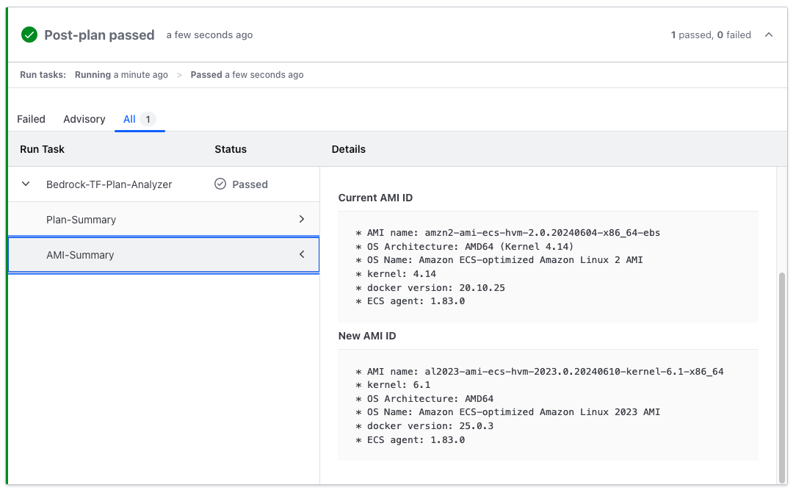

# Runtask Terraform Plan Analyzer

## Overview

Integrate Amazon Bedrock to your HashiCorp Cloud Platform Terraform (Terraform Cloud) Run Tasks for:

* Analyzing Terraform plan and generate short-summary

* Function calling for other API-based analysis (e.g AMI analysis)

### Terraform plan summary

Summarize Terraform plan output in human friendly natural language.


### Function calling (AMI analysis)

Use function calling to execute other tools, such as analyzing AMI data.


### Responsible AI

Implement safeguards using Amazon Bedrock guardrails customized to your organization requirements and responsible AI policies


## Architecture


This module must be deployed in AWS account with access to Amazon Bedrock model. We recommend you to use hub-spoke model, by deploying this module in one dedicated account.

Please refer to the [best-practice](#best-practice) section below for more details.

## Prerequisites

To use this module you need have the following:

1. AWS account and credentials
1. Amazon Bedrock model access (default model is `Claude 3 Sonnet`)
1. HCP Terraform account

## Usage

* Build and package the Lambda files

  ```
  make all
  ```

* Enable Bedrock model access for `Claude 3 Sonnet`. Refer to [this guide for more info](https://docs.aws.amazon.com/bedrock/latest/userguide/model-access.html).

* Reference the `examples/basic` folder on how to use this module

    ```sh
    cd examples/basic
    terraform init
    terraform plan
    terraform apply
    ```

## Best practice

* **Do not** re-use the Run Tasks URL across different trust-boundary (organizations, accounts, team). We recommend you to deploy separate Run Task deployment per trust-boundary.

* **Do not** use Run Tasks URL from untrusted party, remember that Run Tasks execution sent Terraform plan output to the Run Task endpoint. Only use trusted Run Tasks URL.

* Enable the AWS WAF setup by setting variable `deploy_waf` to `true` (additional cost will apply). This will add WAF protection to the Run Tasks URL endpoint.

* We recommend you to setup additional CloudWatch alarm to monitor Lambda concurrency and WAF rules.

* We recommend to add additional topic to the Bedrock Guardrail to fit your organization requirements.
