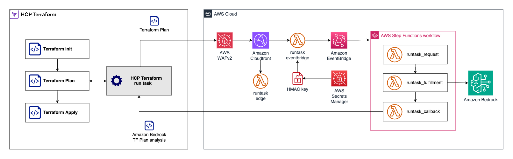

# Runtask Terraform Plan Analyzer

## Overview

Enhance your HashiCorp Cloud Platform Terraform (Terraform Cloud) workflows with AI-powered analysis using Amazon Bedrock. This module integrates seamlessly as a Run Task to provide:

* Intelligent Terraform plan analysis with concise, human-friendly summaries
* Advanced function calling capabilities for extended analysis (e.g., AMI evaluation)
* Responsible AI implementation with customizable guardrails

### Key Features

1. **AI-Powered Plan Summaries**
   * Generate clear, natural language summaries of Terraform plan outputs
   * Quickly understand the impact of infrastructure changes
   

2. **Extensible Analysis with Function Calling**
   * Leverage AI to perform additional analyses, such as AMI evaluation
   * Easily extend to other API-based tools and services
   

3. **Responsible AI Integration**
   * Implement Amazon Bedrock guardrails tailored to your organization's policies
   * Ensure ethical and compliant AI usage in your infrastructure workflows
   

4. **Secure Architecture**
   * Designed for deployment in a dedicated AWS account
   * Optional AWS WAF integration for enhanced endpoint protection
   * Adherence to AWS security best practices

5. **Seamless Terraform Cloud Integration**
   * Operates as a native Run Task within your Terraform Cloud workflow
   * Provides insights without disrupting existing processes

6. **Flexible and Customizable**
   * Adapt the module to fit your specific organizational needs
   * Easily configure and extend guardrails and analysis capabilities

## Architecture



This module leverages a hub-spoke model, designed for deployment in a dedicated AWS account with Amazon Bedrock access. It utilizes AWS Lambda, CloudFront, and other AWS services to provide a scalable and secure solution.

## Prerequisites

To implement this module, you'll need:

1. An AWS account with appropriate credentials
2. Access to Amazon Bedrock (default model: Claude 3 Sonnet)
3. A HashiCorp Cloud Platform (HCP) Terraform account

## Getting Started

For detailed setup instructions and best practices, please refer to the sections below:

* [Usage](#usage)
* [Best Practices](#best-practice)

Enhance your Terraform workflows with AI-powered insights while maintaining security and responsible AI practices.

## Usage

* Build and package the Lambda files

  ```
  make all
  ```

* Enable Bedrock model access for `Claude 3 Sonnet`. Refer to [this guide for more info](https://docs.aws.amazon.com/bedrock/latest/userguide/model-access.html).

* Reference the `examples/basic` folder on how to use this module

    ```sh
    cd examples/basic
    terraform init
    terraform plan
    terraform apply
    ```

## Best practice

* **Do not** re-use the Run Tasks URL across different trust-boundary (organizations, accounts, team). We recommend you to deploy separate Run Task deployment per trust-boundary.

* **Do not** use Run Tasks URL from untrusted party, remember that Run Tasks execution sent Terraform plan output to the Run Task endpoint. Only use trusted Run Tasks URL.

* Enable the AWS WAF setup by setting variable `deploy_waf` to `true` (additional cost will apply). This will add WAF protection to the Run Tasks URL endpoint.

* We recommend you to setup additional CloudWatch alarm to monitor Lambda concurrency and WAF rules.

* We recommend to add additional topic to the Bedrock Guardrail to fit your organization requirements.

## Data Collection

This solution sends operational metrics to AWS (the “Data”) about the use of this solution. We use this Data to better understand how customers use this solution and related services and products. AWS’s collection of this Data is subject to the [AWS Privacy Notice](https://aws.amazon.com/privacy/).