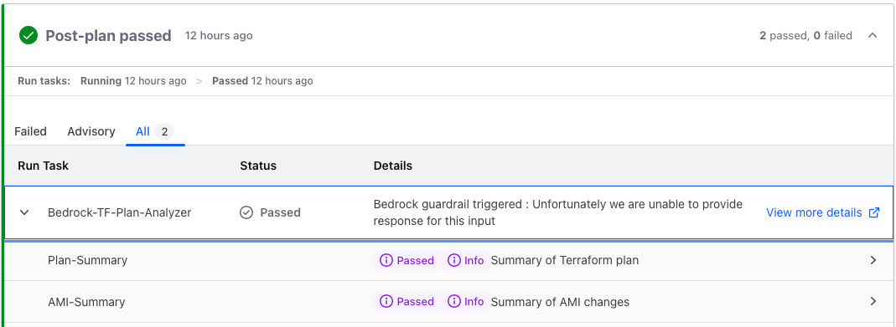

<!-- BEGIN_TF_DOCS -->
# Runtask Terraform Plan Analyzer

## Overview

Enhance your HashiCorp Cloud Platform Terraform (Terraform Cloud) workflows with AI-powered analysis using Amazon Bedrock. This module integrates seamlessly as a Run Task to provide:

* Intelligent Terraform plan analysis with concise, human-friendly summaries
* Advanced function calling capabilities for extended analysis (e.g., AMI evaluation)
* Responsible AI implementation with customizable guardrails

### Key Features

1. **AI-Powered Plan Summaries**
   * Generate clear, natural language summaries of Terraform plan outputs
   * Quickly understand the impact of infrastructure changes
   

2. **Extensible Analysis with Function Calling**
   * Leverage AI to perform additional analyses, such as AMI evaluation
   * Easily extend to other API-based tools and services
   

3. **Responsible AI Integration**
   * Implement Amazon Bedrock guardrails tailored to your organization's policies
   * Ensure ethical and compliant AI usage in your infrastructure workflows
   

4. **Secure Architecture**
   * Designed for deployment in a dedicated AWS account
   * Optional AWS WAF integration for enhanced endpoint protection
   * Adherence to AWS security best practices

5. **Seamless Terraform Cloud Integration**
   * Operates as a native Run Task within your Terraform Cloud workflow
   * Provides insights without disrupting existing processes

6. **Flexible and Customizable**
   * Adapt the module to fit your specific organizational needs
   * Easily configure and extend guardrails and analysis capabilities

## Architecture


This module leverages a hub-spoke model, designed for deployment in a dedicated AWS account with Amazon Bedrock access. It utilizes AWS Lambda, CloudFront, and other AWS services to provide a scalable and secure solution.

## Prerequisites

To implement this module, you'll need:

1. An AWS account with appropriate credentials
2. Access to Amazon Bedrock (default model: Claude 3 Sonnet)
3. A HashiCorp Cloud Platform (HCP) Terraform account

## Getting Started

For detailed setup instructions and best practices, please refer to the sections below:

* [Usage](#usage)
* [Best Practices](#best-practice)

Enhance your Terraform workflows with AI-powered insights while maintaining security and responsible AI practices.

## Usage

* Build and package the Lambda files

  ```
  make all
  ```

* Enable Bedrock model access for `Claude 3 Sonnet`. Refer to [this guide for more info](https://docs.aws.amazon.com/bedrock/latest/userguide/model-access.html).

* Reference the `examples/basic` folder on how to use this module

    ```sh
    cd examples/basic
    terraform init
    terraform plan
    terraform apply
    ```

## Best practice

* **Do not** re-use the Run Tasks URL across different trust-boundary (organizations, accounts, team). We recommend you to deploy separate Run Task deployment per trust-boundary.

* **Do not** use Run Tasks URL from untrusted party, remember that Run Tasks execution sent Terraform plan output to the Run Task endpoint. Only use trusted Run Tasks URL.

* Enable the AWS WAF setup by setting variable `deploy_waf` to `true` (additional cost will apply). This will add WAF protection to the Run Tasks URL endpoint.

* We recommend you to setup additional CloudWatch alarm to monitor Lambda concurrency and WAF rules.

* We recommend to add additional topic to the Bedrock Guardrail to fit your organization requirements.

## Requirements

| Name | Version |
|------|---------|
| <a name="requirement_terraform"></a> [terraform](#requirement\_terraform) | >= 1.5.0 |
| <a name="requirement_archive"></a> [archive](#requirement\_archive) | ~>2.2.0 |
| <a name="requirement_aws"></a> [aws](#requirement\_aws) | >= 5.72.0 |
| <a name="requirement_random"></a> [random](#requirement\_random) | >=3.4.0 |

## Providers

| Name | Version |
|------|---------|
| <a name="provider_archive"></a> [archive](#provider\_archive) | ~>2.2.0 |
| <a name="provider_aws"></a> [aws](#provider\_aws) | >= 5.72.0 |
| <a name="provider_aws.cloudfront_waf"></a> [aws.cloudfront\_waf](#provider\_aws.cloudfront\_waf) | >= 5.72.0 |
| <a name="provider_random"></a> [random](#provider\_random) | >=3.4.0 |
| <a name="provider_terraform"></a> [terraform](#provider\_terraform) | n/a |
| <a name="provider_time"></a> [time](#provider\_time) | n/a |

## Modules

| Name | Source | Version |
|------|--------|---------|
| <a name="module_runtask_cloudfront"></a> [runtask\_cloudfront](#module\_runtask\_cloudfront) | terraform-aws-modules/cloudfront/aws | 3.4.0 |

## Resources

| Name | Type |
|------|------|
| [aws_bedrock_guardrail.runtask_fulfillment](https://registry.terraform.io/providers/hashicorp/aws/latest/docs/resources/bedrock_guardrail) | resource |
| [aws_bedrock_guardrail_version.runtask_fulfillment](https://registry.terraform.io/providers/hashicorp/aws/latest/docs/resources/bedrock_guardrail_version) | resource |
| [aws_cloudfront_origin_request_policy.runtask_cloudfront](https://registry.terraform.io/providers/hashicorp/aws/latest/docs/resources/cloudfront_origin_request_policy) | resource |
| [aws_cloudwatch_event_rule.runtask_rule](https://registry.terraform.io/providers/hashicorp/aws/latest/docs/resources/cloudwatch_event_rule) | resource |
| [aws_cloudwatch_event_target.runtask_target](https://registry.terraform.io/providers/hashicorp/aws/latest/docs/resources/cloudwatch_event_target) | resource |
| [aws_cloudwatch_log_group.runtask_callback](https://registry.terraform.io/providers/hashicorp/aws/latest/docs/resources/cloudwatch_log_group) | resource |
| [aws_cloudwatch_log_group.runtask_eventbridge](https://registry.terraform.io/providers/hashicorp/aws/latest/docs/resources/cloudwatch_log_group) | resource |
| [aws_cloudwatch_log_group.runtask_fulfillment](https://registry.terraform.io/providers/hashicorp/aws/latest/docs/resources/cloudwatch_log_group) | resource |
| [aws_cloudwatch_log_group.runtask_fulfillment_output](https://registry.terraform.io/providers/hashicorp/aws/latest/docs/resources/cloudwatch_log_group) | resource |
| [aws_cloudwatch_log_group.runtask_request](https://registry.terraform.io/providers/hashicorp/aws/latest/docs/resources/cloudwatch_log_group) | resource |
| [aws_cloudwatch_log_group.runtask_states](https://registry.terraform.io/providers/hashicorp/aws/latest/docs/resources/cloudwatch_log_group) | resource |
| [aws_cloudwatch_log_group.runtask_waf](https://registry.terraform.io/providers/hashicorp/aws/latest/docs/resources/cloudwatch_log_group) | resource |
| [aws_cloudwatch_log_resource_policy.runtask_waf](https://registry.terraform.io/providers/hashicorp/aws/latest/docs/resources/cloudwatch_log_resource_policy) | resource |
| [aws_iam_role.runtask_callback](https://registry.terraform.io/providers/hashicorp/aws/latest/docs/resources/iam_role) | resource |
| [aws_iam_role.runtask_edge](https://registry.terraform.io/providers/hashicorp/aws/latest/docs/resources/iam_role) | resource |
| [aws_iam_role.runtask_eventbridge](https://registry.terraform.io/providers/hashicorp/aws/latest/docs/resources/iam_role) | resource |
| [aws_iam_role.runtask_fulfillment](https://registry.terraform.io/providers/hashicorp/aws/latest/docs/resources/iam_role) | resource |
| [aws_iam_role.runtask_request](https://registry.terraform.io/providers/hashicorp/aws/latest/docs/resources/iam_role) | resource |
| [aws_iam_role.runtask_rule](https://registry.terraform.io/providers/hashicorp/aws/latest/docs/resources/iam_role) | resource |
| [aws_iam_role.runtask_states](https://registry.terraform.io/providers/hashicorp/aws/latest/docs/resources/iam_role) | resource |
| [aws_iam_role_policy.runtask_callback](https://registry.terraform.io/providers/hashicorp/aws/latest/docs/resources/iam_role_policy) | resource |
| [aws_iam_role_policy.runtask_eventbridge](https://registry.terraform.io/providers/hashicorp/aws/latest/docs/resources/iam_role_policy) | resource |
| [aws_iam_role_policy.runtask_fulfillment](https://registry.terraform.io/providers/hashicorp/aws/latest/docs/resources/iam_role_policy) | resource |
| [aws_iam_role_policy.runtask_rule](https://registry.terraform.io/providers/hashicorp/aws/latest/docs/resources/iam_role_policy) | resource |
| [aws_iam_role_policy.runtask_states](https://registry.terraform.io/providers/hashicorp/aws/latest/docs/resources/iam_role_policy) | resource |
| [aws_iam_role_policy_attachment.runtask_callback](https://registry.terraform.io/providers/hashicorp/aws/latest/docs/resources/iam_role_policy_attachment) | resource |
| [aws_iam_role_policy_attachment.runtask_edge](https://registry.terraform.io/providers/hashicorp/aws/latest/docs/resources/iam_role_policy_attachment) | resource |
| [aws_iam_role_policy_attachment.runtask_eventbridge](https://registry.terraform.io/providers/hashicorp/aws/latest/docs/resources/iam_role_policy_attachment) | resource |
| [aws_iam_role_policy_attachment.runtask_fulfillment_additional_attachment](https://registry.terraform.io/providers/hashicorp/aws/latest/docs/resources/iam_role_policy_attachment) | resource |
| [aws_iam_role_policy_attachment.runtask_fulfillment_basic_attachment](https://registry.terraform.io/providers/hashicorp/aws/latest/docs/resources/iam_role_policy_attachment) | resource |
| [aws_iam_role_policy_attachment.runtask_fulfillment_bedrock_attachment](https://registry.terraform.io/providers/hashicorp/aws/latest/docs/resources/iam_role_policy_attachment) | resource |
| [aws_iam_role_policy_attachment.runtask_request](https://registry.terraform.io/providers/hashicorp/aws/latest/docs/resources/iam_role_policy_attachment) | resource |
| [aws_kms_alias.runtask_key](https://registry.terraform.io/providers/hashicorp/aws/latest/docs/resources/kms_alias) | resource |
| [aws_kms_alias.runtask_waf](https://registry.terraform.io/providers/hashicorp/aws/latest/docs/resources/kms_alias) | resource |
| [aws_kms_key.runtask_key](https://registry.terraform.io/providers/hashicorp/aws/latest/docs/resources/kms_key) | resource |
| [aws_kms_key.runtask_waf](https://registry.terraform.io/providers/hashicorp/aws/latest/docs/resources/kms_key) | resource |
| [aws_lambda_function.runtask_callback](https://registry.terraform.io/providers/hashicorp/aws/latest/docs/resources/lambda_function) | resource |
| [aws_lambda_function.runtask_edge](https://registry.terraform.io/providers/hashicorp/aws/latest/docs/resources/lambda_function) | resource |
| [aws_lambda_function.runtask_eventbridge](https://registry.terraform.io/providers/hashicorp/aws/latest/docs/resources/lambda_function) | resource |
| [aws_lambda_function.runtask_fulfillment](https://registry.terraform.io/providers/hashicorp/aws/latest/docs/resources/lambda_function) | resource |
| [aws_lambda_function.runtask_request](https://registry.terraform.io/providers/hashicorp/aws/latest/docs/resources/lambda_function) | resource |
| [aws_lambda_function_url.runtask_eventbridge](https://registry.terraform.io/providers/hashicorp/aws/latest/docs/resources/lambda_function_url) | resource |
| [aws_lambda_permission.runtask_eventbridge](https://registry.terraform.io/providers/hashicorp/aws/latest/docs/resources/lambda_permission) | resource |
| [aws_secretsmanager_secret.runtask_cloudfront](https://registry.terraform.io/providers/hashicorp/aws/latest/docs/resources/secretsmanager_secret) | resource |
| [aws_secretsmanager_secret.runtask_hmac](https://registry.terraform.io/providers/hashicorp/aws/latest/docs/resources/secretsmanager_secret) | resource |
| [aws_secretsmanager_secret_version.runtask_cloudfront](https://registry.terraform.io/providers/hashicorp/aws/latest/docs/resources/secretsmanager_secret_version) | resource |
| [aws_secretsmanager_secret_version.runtask_hmac](https://registry.terraform.io/providers/hashicorp/aws/latest/docs/resources/secretsmanager_secret_version) | resource |
| [aws_sfn_state_machine.runtask_states](https://registry.terraform.io/providers/hashicorp/aws/latest/docs/resources/sfn_state_machine) | resource |
| [aws_wafv2_web_acl.runtask_waf](https://registry.terraform.io/providers/hashicorp/aws/latest/docs/resources/wafv2_web_acl) | resource |
| [aws_wafv2_web_acl_logging_configuration.runtask_waf](https://registry.terraform.io/providers/hashicorp/aws/latest/docs/resources/wafv2_web_acl_logging_configuration) | resource |
| [random_string.solution_prefix](https://registry.terraform.io/providers/hashicorp/random/latest/docs/resources/string) | resource |
| [random_uuid.runtask_cloudfront](https://registry.terraform.io/providers/hashicorp/random/latest/docs/resources/uuid) | resource |
| [random_uuid.runtask_hmac](https://registry.terraform.io/providers/hashicorp/random/latest/docs/resources/uuid) | resource |
| [terraform_data.bootstrap](https://registry.terraform.io/providers/hashicorp/terraform/latest/docs/resources/data) | resource |
| [time_sleep.wait_1800_seconds](https://registry.terraform.io/providers/hashicorp/time/latest/docs/resources/sleep) | resource |
| [archive_file.runtask_callback](https://registry.terraform.io/providers/hashicorp/archive/latest/docs/data-sources/file) | data source |
| [archive_file.runtask_edge](https://registry.terraform.io/providers/hashicorp/archive/latest/docs/data-sources/file) | data source |
| [archive_file.runtask_eventbridge](https://registry.terraform.io/providers/hashicorp/archive/latest/docs/data-sources/file) | data source |
| [archive_file.runtask_fulfillment](https://registry.terraform.io/providers/hashicorp/archive/latest/docs/data-sources/file) | data source |
| [archive_file.runtask_request](https://registry.terraform.io/providers/hashicorp/archive/latest/docs/data-sources/file) | data source |
| [aws_caller_identity.current_account](https://registry.terraform.io/providers/hashicorp/aws/latest/docs/data-sources/caller_identity) | data source |
| [aws_iam_policy.bedrock_full_access_managed_policy](https://registry.terraform.io/providers/hashicorp/aws/latest/docs/data-sources/iam_policy) | data source |
| [aws_iam_policy.ec2_readonly_managed_policy](https://registry.terraform.io/providers/hashicorp/aws/latest/docs/data-sources/iam_policy) | data source |
| [aws_iam_policy.lambda_basic_execution_managed_policy](https://registry.terraform.io/providers/hashicorp/aws/latest/docs/data-sources/iam_policy) | data source |
| [aws_iam_policy_document.runtask_key](https://registry.terraform.io/providers/hashicorp/aws/latest/docs/data-sources/iam_policy_document) | data source |
| [aws_iam_policy_document.runtask_waf](https://registry.terraform.io/providers/hashicorp/aws/latest/docs/data-sources/iam_policy_document) | data source |
| [aws_iam_policy_document.runtask_waf_log](https://registry.terraform.io/providers/hashicorp/aws/latest/docs/data-sources/iam_policy_document) | data source |
| [aws_partition.current_partition](https://registry.terraform.io/providers/hashicorp/aws/latest/docs/data-sources/partition) | data source |
| [aws_region.cloudfront_region](https://registry.terraform.io/providers/hashicorp/aws/latest/docs/data-sources/region) | data source |
| [aws_region.current_region](https://registry.terraform.io/providers/hashicorp/aws/latest/docs/data-sources/region) | data source |

## Inputs

| Name | Description | Type | Default | Required |
|------|-------------|------|---------|:--------:|
| <a name="input_aws_region"></a> [aws\_region](#input\_aws\_region) | The region from which this module will be executed. | `string` | n/a | yes |
| <a name="input_hcp_tf_org"></a> [hcp\_tf\_org](#input\_hcp\_tf\_org) | HCP Terraform Organization name | `string` | n/a | yes |
| <a name="input_bedrock_llm_model"></a> [bedrock\_llm\_model](#input\_bedrock\_llm\_model) | Bedrock LLM model to use | `string` | `"anthropic.claude-3-sonnet-20240229-v1:0"` | no |
| <a name="input_cloudwatch_log_group_name"></a> [cloudwatch\_log\_group\_name](#input\_cloudwatch\_log\_group\_name) | RunTask CloudWatch log group name | `string` | `"/hashicorp/terraform/runtask/"` | no |
| <a name="input_cloudwatch_log_group_retention"></a> [cloudwatch\_log\_group\_retention](#input\_cloudwatch\_log\_group\_retention) | Lambda CloudWatch log group retention period | `string` | `"365"` | no |
| <a name="input_deploy_waf"></a> [deploy\_waf](#input\_deploy\_waf) | Set to true to deploy CloudFront and WAF in front of the Lambda function URL | `string` | `false` | no |
| <a name="input_event_bus_name"></a> [event\_bus\_name](#input\_event\_bus\_name) | EventBridge event bus name | `string` | `"default"` | no |
| <a name="input_event_source"></a> [event\_source](#input\_event\_source) | EventBridge source name | `string` | `"app.terraform.io"` | no |
| <a name="input_github_api_token_arn"></a> [github\_api\_token\_arn](#input\_github\_api\_token\_arn) | The ARN of the secret containing the GitHub API token | `string` | `null` | no |
| <a name="input_lambda_architecture"></a> [lambda\_architecture](#input\_lambda\_architecture) | Lambda architecture (arm64 or x86\_64) | `string` | `"x86_64"` | no |
| <a name="input_lambda_default_timeout"></a> [lambda\_default\_timeout](#input\_lambda\_default\_timeout) | Lambda default timeout in seconds | `number` | `120` | no |
| <a name="input_lambda_python_runtime"></a> [lambda\_python\_runtime](#input\_lambda\_python\_runtime) | Lambda Python runtime | `string` | `"python3.11"` | no |
| <a name="input_lambda_reserved_concurrency"></a> [lambda\_reserved\_concurrency](#input\_lambda\_reserved\_concurrency) | Maximum Lambda reserved concurrency, make sure your AWS quota is sufficient | `number` | `10` | no |
| <a name="input_name_prefix"></a> [name\_prefix](#input\_name\_prefix) | Name to be used on all the resources as identifier. | `string` | `"runtask-tf-plan-analyzer"` | no |
| <a name="input_recovery_window"></a> [recovery\_window](#input\_recovery\_window) | Number of days that AWS Secrets Manager waits before it can delete the secret | `number` | `0` | no |
| <a name="input_run_task_iam_roles"></a> [run\_task\_iam\_roles](#input\_run\_task\_iam\_roles) | List of IAM roles to be attached to the Lambda function | `list(string)` | `null` | no |
| <a name="input_runtask_stages"></a> [runtask\_stages](#input\_runtask\_stages) | List of all supported run task stages | `list(string)` | <pre>[<br>  "pre_plan",<br>  "post_plan",<br>  "pre_apply"<br>]</pre> | no |
| <a name="input_tags"></a> [tags](#input\_tags) | Map of tags to apply to resources deployed by this solution. | `map(any)` | `null` | no |
| <a name="input_waf_managed_rule_set"></a> [waf\_managed\_rule\_set](#input\_waf\_managed\_rule\_set) | List of AWS Managed rules to use inside the WAF ACL | `list(map(string))` | <pre>[<br>  {<br>    "metric_suffix": "common",<br>    "name": "AWSManagedRulesCommonRuleSet",<br>    "priority": 10,<br>    "vendor_name": "AWS"<br>  },<br>  {<br>    "metric_suffix": "bad_input",<br>    "name": "AWSManagedRulesKnownBadInputsRuleSet",<br>    "priority": 20,<br>    "vendor_name": "AWS"<br>  }<br>]</pre> | no |
| <a name="input_waf_rate_limit"></a> [waf\_rate\_limit](#input\_waf\_rate\_limit) | Rate limit for request coming to WAF | `number` | `100` | no |
| <a name="input_workspace_prefix"></a> [workspace\_prefix](#input\_workspace\_prefix) | HCP Terraform workspace name prefix that allowed to run this run task | `string` | `""` | no |

## Outputs

| Name | Description |
|------|-------------|
| <a name="output_runtask_hmac"></a> [runtask\_hmac](#output\_runtask\_hmac) | HMAC key value, keep this sensitive data safe |
| <a name="output_runtask_url"></a> [runtask\_url](#output\_runtask\_url) | The Run Tasks URL endpoint, you can use this to configure the run task setup in HCP Terraform |
<!-- END_TF_DOCS -->