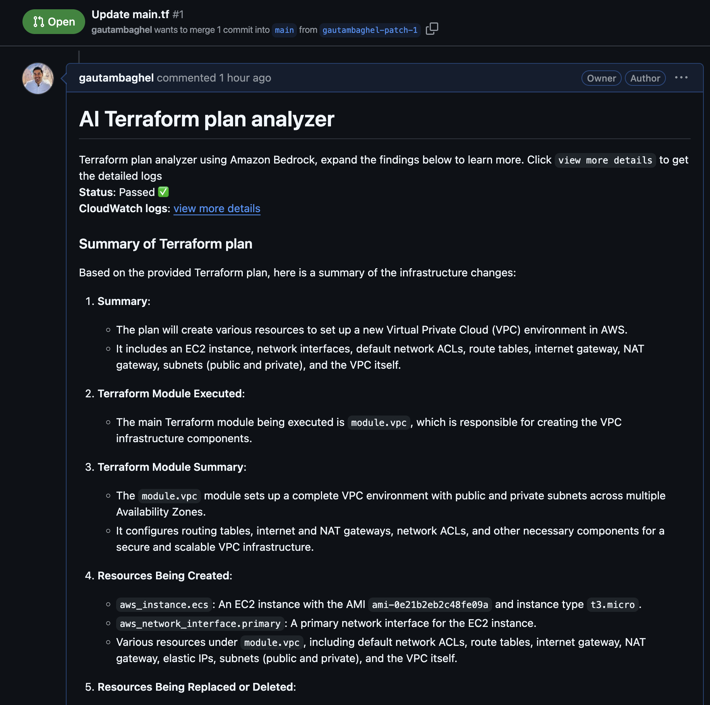

# Usage Example

Follow the steps below to deploy the module and attach it to your HCP Terraform (Terraform Cloud) organization. In order to create comments in Pull requests you'd also need GitHub API token.




* The GitHub token needs to be a [fine-grained personal access tokens](https://docs.github.com/en/authentication/keeping-your-account-and-data-secure/managing-your-personal-access-tokens#creating-a-fine-grained-personal-access-token) with the following permissions:

* Read access to metadata
* Read and Write access to pull requests

* Deploy the module

  ```bash
  terraform init
  terraform plan
  terraform apply
  ```

* (Optional, if using HCP Terraform) Add the cloud block in `providers.tf`

  ```hcl
  terraform {

    cloud {
      # TODO: Change this to your HCP Terraform org name.
      organization = "<enter your org name here>"
      workspaces {
        ...
      }
    }
    ...
  }
  ```
